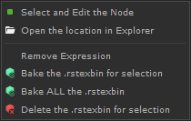

# Features

## Requirements

Tested on Windows 10, some features might not work on other OS.

Tested on Katana 3.6v2 and Katana 4.0v2 with Redshift and 3Delight.

!!! bug ""

    Special characters used in file path (such as whitespaces) may cause issues.


## :material-cog: settings.json file

Located in `Tabs\textureMonitor`

Default setting:
```json
{
  "default_render_engine": "Delight",
  "enable_retex": true,
  "default_ui_width": 1200,
  "locked_paths": [
    "R:\\Imapath\\toafile_exemple.exr",
    "R:\\Imapath\\toafile_exemple02.exr"
  ]
}
```

=== "default_render_engine"

    `string`: Choose the render engine used when the tool is started. 
    
    The value should correspond to the name of a render-engine file existing in
     
    `Tabs\textureMonitor\script\render_engine`

=== "enable_retex"

    `bool`: Choose to enable or not the feature relative to render-engine texture baking (including icons)

=== "default_ui_width"

    `int`: Width in pixel of the UI at startup

=== "locked_paths"

    `list`: List of paths that will appear locked to the user in the UI


## :material-file-tree: TreeWidget

items Color Coding:

- <i style="color:rgb(180, 40, 44)" >Red</i> : The path doesn't exists
- <i style="color:rgb(74, 109, 179)" >Blue</i>:  The path parameter is computed by an expression
- <i style="color:rgb(220, 220, 220)"> White</i>: Default color
- <i style="color:rgb(140, 140, 140)" >Grey</i>: This is a "locked" texture, that you can't touch. Probably used in a livegroup.

!!! warning ""

    Some render-engines support advanced tokens (such as `<shapeName>`) that could only be evaluated at render time.
    
    This means that for root item with such token the children file path are **potential matches**

Icons for render-engine textures.=:

|                                                   |                                                                  |
| -----------                                       | ----------------                                                 |
|        | All the re-tex are baked for this item.                          |
|      | There is no re-tex baked for this item                           |
|     | Some re-tex has been baked for this item (root item with child item) |


## :material-mouse: Right-click menu 

This example is with Redshift:

{: align=left } 

`Select and Edit the node`: select and edit the texture node

`Open the location in Explorer`: doesn't need explanation

`Remove Expression`: if the file path parameter is computed thanks to an expression you can set it to constant.

`Bake the .re-tex for selection`: if the selected item has children it will also bake all the children.

`Bake ALL the .re-tex`: will bake the re-tex for all the items in the TreeWidget

`Delete the .re-tex for selection`: if the selected item has children it will delete all the child rstexbin.


## :material-find-replace: Search and replace

The search and replace module is located at the top left above the treeview.

The first field is the text you are looking to match.
The second field is to enter the text that should replace the first one.

!!! info ""
    When the `Ignore Expressions` checkbox is checked, only the path that are **not computed** by expressions are
    going to be modified.
    Else, when unchecked, if the path is computed by an expression it will be set to constant.

####  the *search* and *replace* fields

The `search` field will work using regular expressions (from the `re` python module).
It means you can use special characters to create matching expressions. (see more details bellow)

For example using: `texture_\d` will match any text that starts with `texture_` and end with a decimal digit.

!!! warning

    If you would like to match only a single `\` you will have to double it like `\\` 
    
    **Ex**: you would like to match `textures\texture01.exr` from `D:\projects\textures\texture01.exr`, 
    use `textures\\texture01.exr` in the search field.

To know how to use regular expression (which is quite complex) you can follow this tutorial: 
<https://www.datacamp.com/community/tutorials/python-regular-expression-tutorial>


The `replace` field doesn't have anything particular. You can use single backslash `\` without issues.