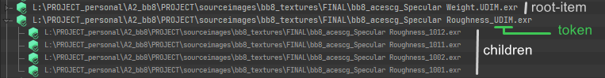

# :material-book-open-page-variant: Start Guide

## Installation

For the first time, you will not need to do any particular manipulation to make the tool work, but you might want
to modify his behaviour depending of your workflow.

The tool was made to support any render-engine but right now only `Redshift`, `3Delight` and `Arnold` 
are supported, with the last two having limited render-engine texture baking features. This could be
improved in the future if I get some help.

Else you can follow the guide in the [development section](development.md) to add or customize your render-engine support.

### :material-transfer-down: Registering the tool in Katana

Once downloaded you will need to place the `Tabs` folder in a location registered by Katana as
 a `KATANA_RESOURCES` location.

Here is a step by step tutorial for :material-microsoft-windows:Windows:

* Put the `Tabs` folder somewhere on your disk for example in `D:\resources\katana\katana_resources_v01`

* In the .bat file used to launch your Katana, find the line where you set the `KATANA_RESOURCES` variable.

* Just before create a variable pointing to your resources directory (`D:\resources\katana\katana_resources_v01`)

```bash
set "RESOURCES_PERSO=D:\resources\katana\katana_resources_v01"
```

* Then extend the `KATANA_RESOURCES` variable with the variable you just created. Use `;` to add multiple locations.

```bash
rem This example also register Redshift and USD
set "KATANA_RESOURCES=%REDSHIFT4KAT_HOME%;%RESOURCES_PERSO%;%KATANA_HOME%\plugins\Resources\Usd\plugin;"
```

* And you are done, you can just then launch Katana with the .bat.

* The tool can then be find in the Tabs menu in the top bar.


### Behaviour customization

If you go in the `\Tabs\textureMonitor` folder you will find a `settings.json` file. This file allow you to 
customize preferences for the tool.

!!! question " modifying a json file"

    If you are not familiar with the json file format here is some tips:
    
    * You can open it in any text editor to edit it.
    * You have to respect the formatting to not raise errors:
        * `true` or `false` are in lower case
        * there is a `,` at the end of all line except the last one
        * strings have to be surrounded by `"`

Please refer to the [feature section](features.md#settings.json-file) for all the details.

If you would like to add a render-engine or modify the behaviour of an existing one please refer to 
the [development section](development.md).


## :material-star-circle-outline: Principe

Core of the tool are `texture nodes`. Texture node are **shadingNode** varying based on the render-engine used.
For 3Delight these nodes are named dlTexture for example and can be found in NetworkMaterials. 
This tool will not list file paths than can be used in lights or in attributes.

For every `texture node` find in your scene you will have a `root-item` in the `TreeWidget` 
(if the path parameter is non-empty). 
`root-item` is a top-level item that can have zero or more children. These items can have children if the filepath use
a token that can refer to multiple file paths. The must common token is the `<UDIM>` one (writing can change depending
 of the render engine).

If such token exists in the path the tool will find the texture it *(might)* refer to and add it as a children of
the root item. To see the children of a root-item you can expand it by double clicking on it or clicking on the
arrow at it left.



## :material-cupcake: render-engine texture baking

All render-engine used an optimized proprietary image format to store textures. For some render-engine it is required
to manually create this textures, or just to get the control on it in the pipeline.

This tool allow you to create and manage this render-engine textures (let's called them `re-tex`) effortless.

!!! info 

    This feature can be disabled globally in the `settings.json` if not desired.

You can easily see if the re-tex has been baked for an item in the TreeWidget thanks to their icon:

|                                                   |                   |
| -----------                                       | ----------------|
|        | All the re-tex are baked for this item.  |
|      | There is no re-tex baked for this item |
|     | Some re-tex has been baked for this item (root item with child item) |

To perform any re-tex related action you have to right-click on a item.
This will open a context menu with option on it , please refer to the [Features section](features.md#right-click-menu)
to get all the details.

## :material-find-replace: Search and replace

The tool also ship with a search & replace feature that allow you to modify the path of multiple textures in one go.
Everything is explained in the [Features section](features.md#search-and-replace).