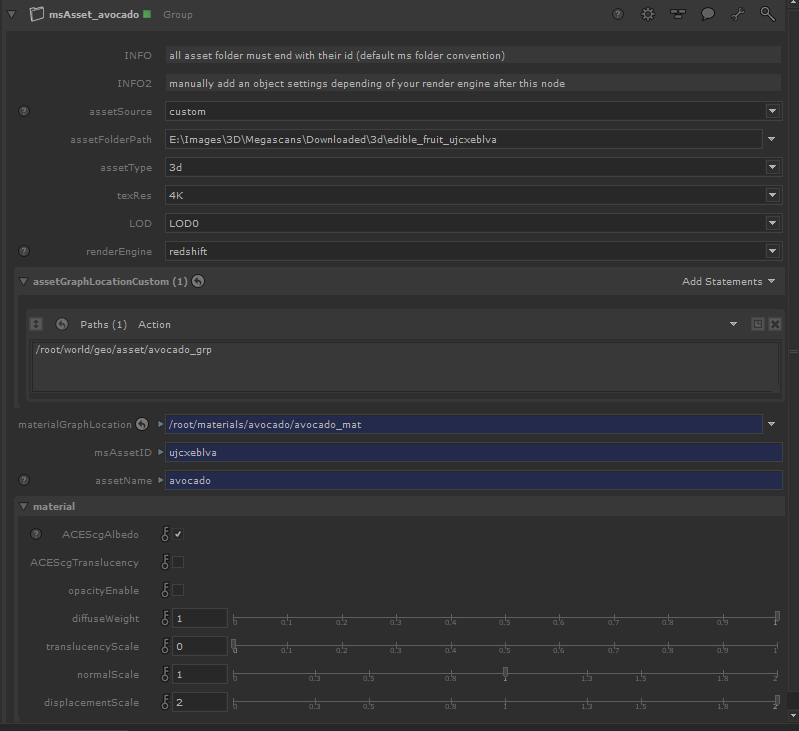

# :material-collapse-all-outline: Features

_This section is a work in progress_

### original assetSource

1. Change the asset Folder Path

2. Change the asset type corresponding to the asset

3. Change other settings according to your rendering preferences

### custom assetSource

1. Change the asset Folder Path for the asset you want to shade.

2. Change the asset type corresponding to the asset

3. Enter the scene graph path of the assets in assetGraphLocationCustom

When using a 3dplant you should precise the atlas ID to have the material working ( copy/paste the id of a texture in the Textures folder)

And read the help hint next to the parameters for more details.

## SPECIFICITIES

- Auto-setuped to have your asset textured with the albedo in the Hydra viewer.

- Groups should be placed one after the precedent in case of using a custom geo.(as on the visual)
- Only work with .exr and .abc be sure to have this file in your asset directory
- You can't use customGeometry with surface and atlas assetType