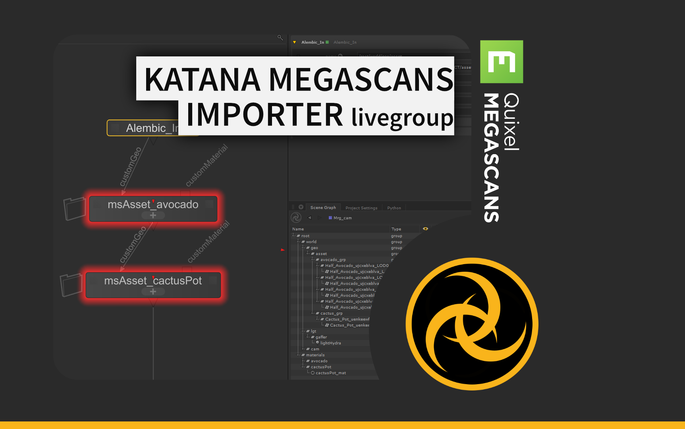

# Megascans Importer live group

!!! success "Get the app"

    :material-download: Download the app here: <https://gum.co/ms4katana>

!!! info ""

    Import Megascans asset quickly in Katana.
    
    Premade for Redshift, Arnold and 3Delight but support importing custom material.

    You can choose to import custom geometry (ex: set dressed scene) and use the group to assign the material.

