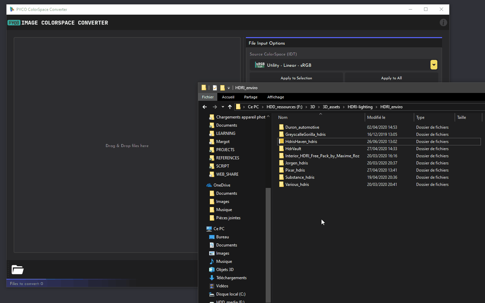
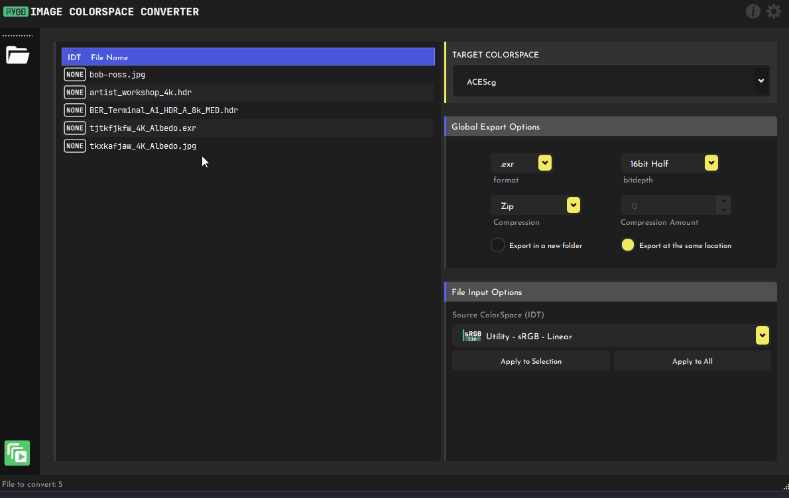
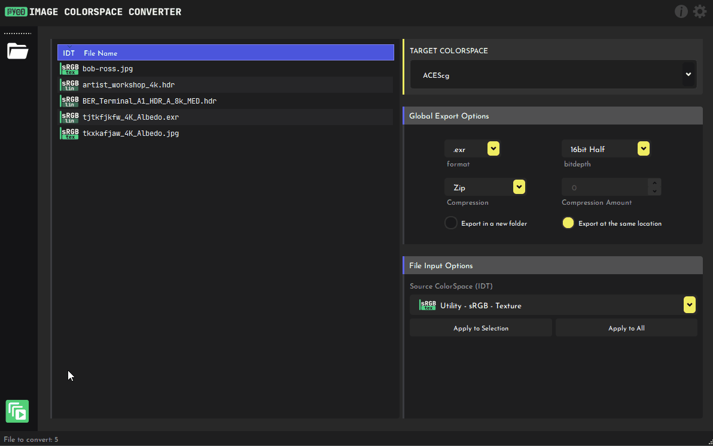

# :material-book-open-page-variant: GETTING STARTED
## :material-arrow-down-bold-circle: Installation
Pyco Colorspace can be downloaded here: <https://gum.co/pycocs>

Choose the package to download depending on the OS you are on.

## :material-numeric-1-box: Import files
You can simply drag & drop any supported file(s) or even just a folder.
You can also click on the folder icon to open files through your OS explorer.

!!! warning ""

    
:material-alert: When dragging a folder all the files inside it **and** its 
    sub-directories will be added!
 

To delete a file you can simply select it and press ++del++ or ++backspace++ .

## :material-numeric-2-box: Set the IDT
The IDT (Input Device Transform) specifies the input file colorspace primaries, white point and 
transfer-function. 

!!! example ""

    For example Utility-sRGB-Texture specifies that the file has sRGB primaries with 
    the sRGB EOTF transfer function while Utility-sRGB-Linear specifies that the transfer function is Linear

To apply an IDT to the desired files:

- Select one or multiple files in the list (shift+click)
- Select the desired IDT in the dropdown menu.
- Click on Apply to Selection / Apply to All (No selection is needed for this one)

!!! tip ""
    You can also click & drag down/up to select multiple files quickly in the list.
    

## :material-numeric-3-box: Change Output options
### :material-numeric-3-box::material-numeric-1-box: Select the colorspace to convert file primaries to in the dropdown.

!!! tip ""
    If the IDT and Target Colorspace are the same no conversion will happen.
    

### :material-numeric-3-box::material-numeric-2-box: Select your output format:

!!! success "exr"

    The professional-grade image storage format of the motion picture industry to be used in your 3D applications for 
    input such as textures, HDRIs, etc but not for your final displayable-delivery-content.

!!! danger "jpg, png"
    
    Low dynamic range displayable file formats suitable for online-view , previews, thumbnails, etc.
    A Transfer-function / ODT is required to be applied.

### :material-numeric-3-box::material-numeric-3-box: Select your bitdepth (output format dependent)

!!! warning
    When converting HDRIs it is recommended to output a 32bit Float file to not clip any values
    
### :material-numeric-3-box::material-numeric-4-box:  Pick your compression method (exr only)

- **None:** No compression, for archive files mostly. Or if you need maximum reading speed.

- **PIZ:** (lossless) Same speed for decompression/compression. Best for scan-line based files.

- **Zip:** (lossless) faster decompression and slower compression than PIZ. Best for textures.

- **Zips:** (lossless) Same, but can be write/read faster in some software.

- **Dwaa:** (lossy) Produce very light files (default compression amount: 45)

- **Dwab:** (lossy) Same as above, but can generate faster result in some applications.

- **B44:** (lossy) Only for HALF-Float images. Best for real-time playback of image sequence.

Read more about this here: <https://www.exr-io.com/openexr-data-compression/> .

### :material-numeric-3-box::material-numeric-5-box: Set the compression amount (output format & compression method dependent)

- **jpg:** 100 = Max Quality; 0 = Minimum quality, but light files
- **exr(dwaa/dwaab):** 0 means Max quality
  
### :material-numeric-3-box::material-numeric-6-box: Select your output location option.
*Refer to the Functionalities page.*

## :material-numeric-4-box: Start The Conversion
Click on the green "play" button in the toolbar to start converting.
When a file is converted, it will be removed from the list.
If you click on "Abort", the currently converted files will still be converted.

## :material-format-list-bulleted: Some Examples

!!! quote ""

    Importing a 3d render in .exr, rendered with ACEScg primaries and applying an ODT for sharing on Internet:
    
    **IDT**: ACEScg ; 
    
    **TargetColorSpace**: ACEScg ; 
    
    **Output format**: .jpg ; **Compression**: 100 (max quality) ;
    
    **ODT**: sRGB(ACES)

!!! quote ""

    Importing a albedo texture in .exr from Megascans (sRGB primaries) and convert it to ACEScg
    
    **IDT**: Utility - Linear- sRGB ; 
    
    **TargetColorSpace**: ACEScg ; 
    
    **Output format**: .exr; **BitDepth**: 16b Half-Float;  **Compression**: zip;

