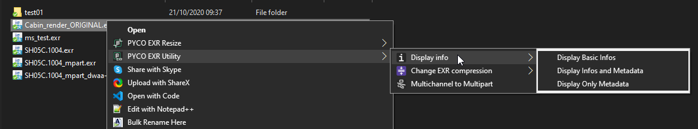
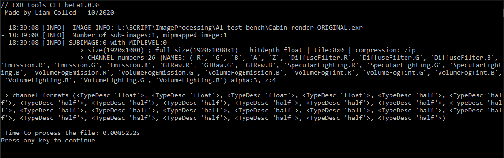

# EXR Tools for Windows

## THIS APP IS IN DEVELOPEMENT AND NOT RELEASED YET

!!! success "Get the app"

    :material-download: Download the app here: <https://gum.co/exrtools>

!!! info ""

    This tool is composed of a command line application and an installer to create a right click context menu for EXR files.
    It allow you to perform various operation such as resizing, changing compression method, displaying infos, ...
    

 
    
This tool includes a command line interface application, which means no real interface to interact with but lines of commands. 
Please refer to the [startguide](startguide.md) for having an explanation of how to use it if you never used CLI(command line interface).
 
## Some features
### :material-resize: Resizing

There is two method for resizing exrs, swap-resize and resize.

**Swap resize** was made to perform optimisation on existing textures in a production. It will resize the existing texture,
rename the original with a prefix so it can be reversed, and rename the resized version with the same name as the original.
Thus, you can quickly resize texture used in your DCC without having to update the path.

**Resize** is the traditionnal resize that will create a new exr resized to the given dimensions.

Both method strictly resize to a 1x1 ratio and were designed mainly for textures in mind.

### :material-image-multiple-outline: Multi-channel to Multi-part

When rendering you have the option to include some AOVs in the same exr file. This is usually referred a multi-layer EXR,
where a single exr holds multiples images.
Where the thing get interesting is that there is actually two types of EXR that can hold multiples "images".

The **multi-channel** one consists of creating as much channel as you need for each image, so for example if you display
the channels of a multi-channel EXR you will have something like that: 
`('R', 'G', 'B', 'A', 'Z', 'Diffuse.R', 'Diffuse.G', 'Diffuse.B', 'Emission.R', 'Emission.G', 'Emission.B', 'GIRaw.R', 'GIRaw.G', 'GIRaw.B')`
At the beginning of the existence of the EXR format this was the only method available, now that the other one exists this method
produce EXR that are much slower to read (it depends of the number of channels).

The **multi-part** one is like having multiple images(refered as parts or sub-images) in one single file. When opened, 
only the desired part is read which product faster read result than the multi-channel method.

You can use the Display Info functions to see if your exr is multi-part or multi-channel.

###  :material-arrow-collapse-vertical:Recompress

EXR offer different methods of compression divided into lossless or lossy.

From the official documentation(<https://www.openexr.com/documentation/TechnicalIntroduction.pdf>):
Compressing  an  image  with  a  lossless  method  preserves  the  image  exactly;  the  pixel  data  are  not altered.
Compressing  an  image  with  a  lossy  method  preserves  the  image  only  approximately;  the compressed image 
looks like the original, but the data in the pixels may have changed slightly.

No matter if it's a multi-part or multi-channel EXR you will be able to change the compression of the whole file with this tool.

Available: `none, rle, zip, zips, piz, pxr24, b44, b44a, dwaa, dwab`

### :material-information-outline: Display Informations

Quickly display informations about the exr including metadata.
Exemple for a multi-channel render:

     
## :material-account-group: CONTRIBUTORS

**Development made possible thanks to**

- <a href=https://github.com/fredrikaverpil/oiio-python> Fredrik Averpil's and Sidney Guenther's work </a>
- <a href=https://materialdesignicons.com> Material Design Icons </a>
- <a href=https://sites.google.com/site/openimageio/home> OpenImage IO </a>
- <a href=https://www.docstring.fr/> Thibault Houdon Formations </a>
